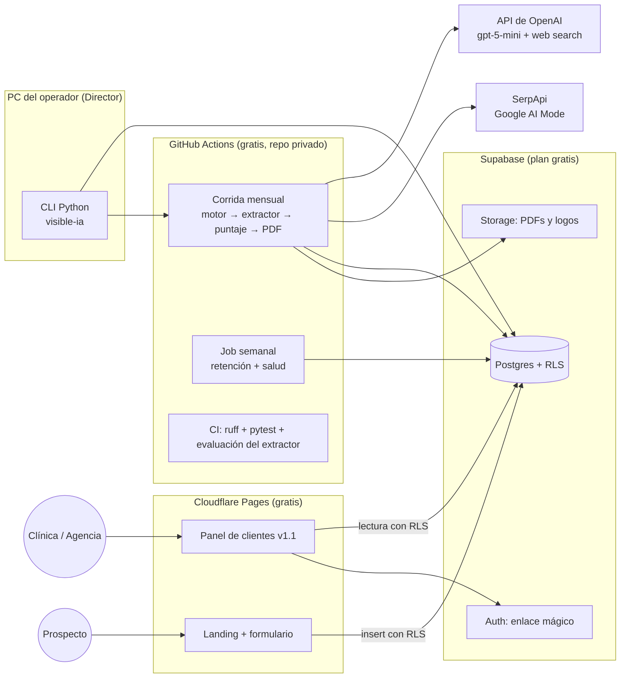

# 🏗️ Arquitectura (Fase 4)
<!-- CÓMO se construye. Cada elección importante debe tener un ADR en docs/decisiones/. Base: PRD v1 congelado (26/09/2026), ADR-002 (motor), ADR-003 (repeticiones), ADR-004 (stack). -->

## Diagrama general


**Idea central:** nada queda encendido. Así se cumple el requisito de US$0 fijo al mes.
- **Python** hace todo el trabajo de datos (motor, extractor, puntaje, informes), desde la **CLI del operador** o desde **GitHub Actions**.
- **Supabase** guarda los datos, maneja el login y los archivos.
- **La web** (landing y panel) son páginas estáticas en Cloudflare Pages, que leen Supabase protegidas por **Row Level Security (RLS)**. Cada cliente solo ve sus filas.

## Stack tecnológico
| Capa | Tecnología | Por qué (ADR) |
|---|---|---|
| Lenguaje | **Python 3.12+** para todo lo de datos; HTML + JavaScript mínimo (sin framework) en el navegador | Lo prefiere el Director, ya hay scripts en Python y es fuerte en datos (ADR-004) |
| Herramientas Python | `uv` (dependencias), `ruff` (estilo), `pytest`, `pydantic` (modelos), `typer` (CLI), `httpx`, `openai` (SDK oficial), `rapidfuzz` (coincidencia de nombres), `jinja2` (plantillas HTML) | Estándar, livianas y gratis (ADR-004) |
| Motor: ChatGPT | API de OpenAI, **Responses API + herramienta `web_search`**, `user_location` = Lima (PE), modelo **gpt-5-mini** | ADR-002 |
| Motor: Google Modo IA | **SerpApi**, Google AI Mode API (`location` = Lima, `hl=es`, `gl=pe`), plan gratis de 250 búsquedas/mes | ADR-002 |
| Extractor | **gpt-5-nano** con salida estructurada (JSON Schema) para listar las clínicas en orden + `rapidfuzz` y la tabla de alias para asociarlas a las clínicas del mercado. Las fuentes salen de las citas de cada API | Barato (≈ US$0.01 por mercado al mes) y robusto frente a formatos variados. Se valida con el conjunto de evaluación del PRD §5.3 (ADR-004) |
| Puntaje | Python puro: Wilson, prueba de 2 proporciones y ventana móvil de 3 meses, sin librerías pesadas | ADR-003 |
| Informes PDF | HTML con `jinja2` → PDF con **Playwright (Chromium)** | Funciona igual en Windows y en Linux (Actions). El diseño se hace en HTML/CSS (ADR-004) |
| Base de datos | **Supabase Postgres** (plan gratis: 500 MB, 2 proyectos activos), con migraciones SQL versionadas en `supabase/migrations/` | ADR-004 |
| Autenticación | **Supabase Auth** con enlace mágico por correo (v1.1). Permisos con **RLS** por cliente y por agencia | PRD HU-19 y §6 (ADR-004) |
| Archivos | Supabase Storage (1 GB gratis): PDFs de informes y logos de agencias | ADR-004 |
| Tareas programadas | **GitHub Actions**: corrida mensual (`schedule` + botón manual), job semanal y CI. Repo privado: 2,000 min/mes gratis | ADR-004 |
| Web (landing y panel) | **Cloudflare Pages** (sitio estático). Estilos con **Pico CSS** y `supabase-js` desde CDN | Vercel queda descartado: su plan Hobby prohíbe el uso comercial (ADR-004) |
| WhatsApp (v1.2) | API de WhatsApp Cloud de Meta. El envío sale de Python en Actions; el webhook de respuestas, si hace falta, va en una Supabase Edge Function | Se decide al planificar la v1.2 |
| Pagos | v1.1: registro manual en la CLI. v1.2: suscripción de Culqi o Mercado Pago con webhook (Edge Function) | Estrategia (link de pago manual al inicio) |
| Pruebas | `pytest` (unitarias e integración), **evaluación del extractor** con el conjunto etiquetado y **pruebas de RLS** (un cliente no puede leer a otro) | PRD §5.3 y §6 |

## Modelo de datos
| Entidad | Campos principales | Relaciones |
|---|---|---|
| `rubro` | código (IMP, EDE, MES, DER), nombre | 1–N `plantilla`, `mercado` |
| `plantilla` | id (p. ej. IMP-01), forma (M/R/C/P), texto con `{d}`, versión, activa | N–1 `rubro` |
| `mercado` | id, rubro, distrito, versión del banco de preguntas, activo | 1–N `pregunta`, `corrida`; N–M `clinica` |
| `pregunta` | id, mercado, plantilla, texto final, versión | N–1 `mercado` |
| `clinica` | id, nombre, dirección, distrito, ★, n.º de reseñas, web, Instagram, enlace de la ficha de Google, fecha del dato | N–M `mercado` (vía `clinica_mercado`); 1–N `alias` |
| `alias` | clínica, texto del alias | N–1 `clinica` |
| `corrida` | id, mercado, mes, tipo (API / manual), estado (pendiente, en curso, incompleta, completa, revisada), costo estimado y real | 1–N `respuesta` |
| `respuesta` | id, corrida, pregunta, superficie (`chatgpt_api`, `google_ai_mode`, `chatgpt_app_manual`, `gemini_app_manual`), repetición, modelo o proveedor, texto, JSON crudo, fecha y hora, costo, **fecha de purga** (+12 meses) | 1–N `mencion`, `fuente` |
| `mencion` | respuesta, orden, texto tal como aparece, clínica (o nula = "nueva"), estado (auto, corregida, descartada) | N–1 `respuesta`, `clinica` |
| `fuente` | respuesta, URL, dominio, tipo (ficha Google, Doctoralia, web propia, redes, directorio/ranking, prensa, otra) | N–1 `respuesta` |
| `puntaje_mensual` | mercado, mes, clínica, superficie (o "combinado"), n.º de respuestas, apariciones, índice, límites IC, posición media, cuota de menciones, cambio vs mes anterior (sube / baja / sin cambio claro), índice de la ventana de 3 meses | Calculado desde `mencion`; se guarda para el histórico |
| `cliente` | id, tipo (clínica / agencia), nombre, contacto, agencia madre (nula si es directa), logo y colores (agencia), estado | 1–N `sede`, `usuario`, `pago` |
| `sede` | cliente, clínica, mercado, activa desde / hasta | N–1 `cliente`, `clinica` |
| `usuario` | id de Supabase Auth, cliente, rol (clínica, agencia) | N–1 `cliente` |
| `tarea` | sede, código del checklist, estado, fecha | N–1 `sede` |
| `informe` | tipo (diagnóstico, mensual), clínica o sede, mes, ruta del PDF, marca (visible-ia / agencia) | N–1 `clinica` o `sede` |
| `prospecto` | nombre, clínica, distrito, rubro, contacto, UTM, consentimiento (sí/no + fecha), estado, **no contactar** | Opcional: N–1 `clinica` |
| `pago` | cliente, periodo, monto, medio (link, Yape, transferencia, suscripción), fecha, referencia | N–1 `cliente` |

**Retención (ADR-002):**
- El job semanal borra el texto y el JSON crudo de las `respuesta` con más de 12 meses. Las `mencion`, `fuente` y `puntaje_mensual` se conservan.
- Al terminar un cliente, sus datos propios (usuarios, tareas, pagos) se eliminan 12 meses después.

## Estructura de carpetas del código
```
src/visible_ia/
  config.py              # lee .env / variables de entorno (pydantic-settings)
  db.py                  # conexión a Postgres (psycopg) y consultas
  cli.py                 # comandos: mercado, clinicas, corrida, revisar, puntaje, informe, pagos
  mercados/              # plantillas → preguntas, importación de CSV de clínicas, alias
  motor/                 # chatgpt_api.py, google_ai_mode.py, presupuesto.py, corrida.py (reanudable)
  extractor/             # llm.py (gpt-5-nano), matching.py (alias + rapidfuzz), fuentes.py (dominio → tipo)
  puntaje/               # estadistica.py (Wilson, 2 proporciones), indice.py (mensual y ventana de 3 meses)
  informes/              # plantillas/*.html.j2, pdf.py (Playwright)
  recomendaciones/       # checklist.py, schema_jsonld.py
supabase/migrations/     # esquema SQL + políticas RLS (versionadas)
web/                     # landing (index.html) y panel (panel/*.html), estáticos
data/                    # plantillas-preguntas.csv, conjuntos de evaluación etiquetados
tests/                   # unit/, integration/, eval/ (extractor), rls/
.github/workflows/       # ci.yml, corrida-mensual.yml, semanal.yml
scripts/                 # scripts de la fase 1 (prueba de la API de Gemini), fuera del producto
```

## Entornos
| Entorno | URL | Rama | Cómo se despliega |
|---|---|---|---|
| Local | CLI en la PC del operador; web con `python -m http.server` | cualquiera | — Apunta al proyecto de Supabase **dev** |
| Staging | Vista previa de Cloudflare Pages (una URL por rama) | ramas `feat/*`, `fix/*` | Automático al hacer push. Usa Supabase **dev** |
| Producción | Dominio propio (se compra con el primer cliente); mientras tanto, `*.pages.dev` | `main` | Web: automático al fusionar a `main`. Base de datos: migraciones con un workflow manual (`supabase db push`) que aprueba el Director |

- **Supabase:** dos proyectos, **dev** y **prod**. Es el máximo de 2 activos que permite el plan gratis.
- **Corridas reales:** siempre contra **prod**, desde `main`.

## Seguridad
- **Manejo de secretos:**
  - Local: `.env` (en `.gitignore`).
  - En Actions: *GitHub Secrets*.
  - La clave **`service_role`** de Supabase y las de OpenAI y SerpApi **nunca** llegan al navegador.
  - La web solo usa la clave pública `anon`, limitada por RLS.
- **Autenticación y permisos:**
  - Enlace mágico de Supabase Auth.
  - Políticas RLS: un usuario de clínica lee solo las sedes de su cliente; un usuario de agencia, las sedes de los clientes cuya agencia madre es la suya.
  - El formulario de la landing solo puede **insertar** en `prospecto`, nunca leer.
  - **Cada política tiene una prueba automática.**
- **Datos personales:**
  - Ningún dato de pacientes.
  - Nombres de profesionales solo como nombre del establecimiento.
  - Prospectos con origen, consentimiento y "no contactar".
  - Retención según el ADR-002.
  - La revisión de la Ley 29733 sigue pendiente (estrategia).
- **Términos de uso:** solo API de OpenAI y SerpApi (ADR-002). El código no incluye automatización de las apps de consumo.
- **Presupuesto:**
  - El motor calcula el costo de cada corrida antes de ejecutarla.
  - Se detiene si se superaría el tope mensual (por defecto US$10) o la cuota de SerpApi (PRD HU-05).

## Costos estimados mensuales
> Insumo: [costos-medicion-api.md](costos-medicion-api.md) (26/09/2026). Medir con API cuesta ≈ US$5–29 al mes para 5–30 mercados. El riesgo legal (C-001) se resolvió en el ADR-002.

| Servicio | Plan | Costo con 5 mercados |
|---|---|---|
| Supabase | Free (500 MB, 1 GB de archivos) | US$0 |
| Cloudflare Pages | Free | US$0 |
| GitHub Actions | Free, repo privado (2,000 min/mes; se estiman ~100–400 min) | US$0 |
| API de OpenAI (motor, 150 llamadas) | Pago por uso | ≈ US$3.65 · **requiere la aprobación del Director para activar la facturación** |
| API de OpenAI (extractor gpt-5-nano, 300 respuestas) | Pago por uso | ≈ US$0.05 |
| SerpApi | Free (250 búsquedas/mes; 150 usadas) | US$0 |
| Dominio | Se compra con el primer cliente | ≈ US$1 |
| WhatsApp Cloud API (v1.2) | Pago por mensaje | ≈ US$0.02 por respuesta de servicio |
| **Total** | | **≈ US$4 al mes** (dentro del tope de US$20 de la validación) |

**Cuándo deja de alcanzar lo gratis:**
- **SerpApi:** a partir de ~8 mercados → DataForSEO (depósito de US$50) o SerpApi de pago. Se decide con el primer ingreso (ADR-002).
- **Supabase:** más de 500 MB, o si se necesitan copias de seguridad automáticas → plan Pro, US$25 al mes.
  - Mientras tanto, el job semanal exporta un respaldo (`pg_dump`) como artefacto privado de Actions.

## Riesgos técnicos
| Riesgo | Mitigación |
|---|---|
| Supabase pausa el proyecto tras 1 semana sin actividad | El job semanal (retención y salud) hace actividad real cada semana |
| La API de OpenAI difiere de la app | Calibración manual mensual (PRD §5.4) |
| El formato de respuesta de SerpApi cambia | Se guarda el JSON crudo; el extractor trabaja sobre el texto; hay una prueba de contrato con una respuesta guardada |
| Los límites de los planes gratis cambian | Se revisan las páginas de precios en cada cierre de fase; los costos quedan en este documento |
| El extractor LLM se equivoca | Revisión manual antes de publicar (HU-08) + evaluación automática en CI (PRD §5.3) |

## Fuentes (consultadas el 26/09/2026)
- Supabase, precios del plan gratis: https://supabase.com/pricing
- GitHub Actions, minutos incluidos: https://docs.github.com/en/billing/concepts/product-billing/github-actions
- Vercel, uso comercial en Hobby: https://vercel.com/docs/limits/fair-use-guidelines (*"Hobby teams are restricted to non-commercial personal use only"*)
- Cloudflare Pages, límites: https://developers.cloudflare.com/pages/platform/limits/ (no se encontró una restricción de uso comercial en el plan gratis; verificar en los términos antes del lanzamiento)
- Costos de las APIs de medición: [costos-medicion-api.md](costos-medicion-api.md)

## ✅ Puerta de aprobación
- Aprobado por el Director el: _(pendiente)_
