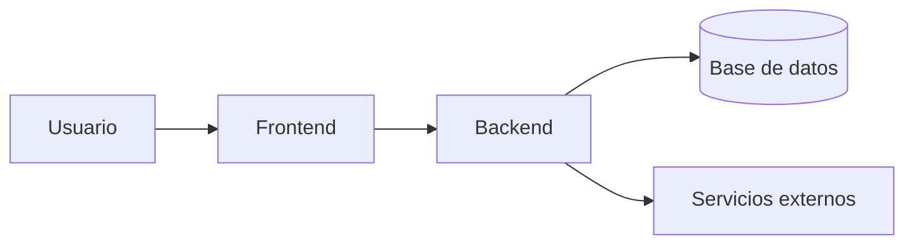

# 🏗️ Arquitectura (Fase 4)
<!-- CÓMO se construye. Cada elección importante debe tener un ADR en docs/decisiones/. -->

## Diagrama general


## Stack tecnológico
| Capa | Tecnología | Por qué (ADR) |
|---|---|---|
| Frontend | | |
| Backend | | |
| Base de datos | | |
| Autenticación | | |
| Hosting / despliegue | | |
| Pagos (si aplica) | | |
| Pruebas | | |

## Modelo de datos
| Entidad | Campos principales | Relaciones |
|---|---|---|

## Estructura de carpetas del código
```
src/
tests/
```

## Entornos
| Entorno | URL | Rama | Cómo se despliega |
|---|---|---|---|
| Local | localhost | cualquiera | — |
| Staging | | develop / main | |
| Producción | | tags `v*` | |

## Seguridad
- Manejo de secretos (`.env`, nunca en Git): 
- Autenticación y permisos: 
- Datos personales: 

## Costos estimados mensuales
> Insumo: [costos-medicion-api.md](costos-medicion-api.md) (26/09/2026). Medir con API cuesta ≈ US$5–29 al mes para 5–30 mercados; el riesgo está en los términos de grounding de Gemini (C-001).

| Servicio | Plan | Costo |
|---|---|---|
